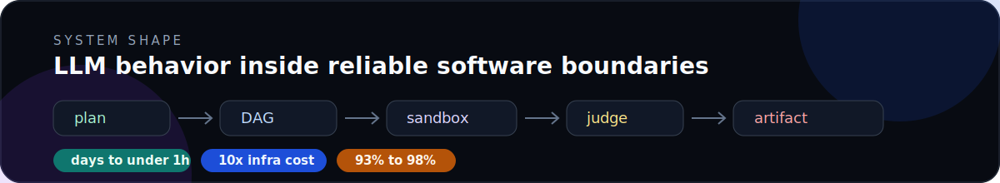

# Production AI systems, not AI demos

I am Himadri Mishra, a senior AI engineer building agentic workflows, LLM systems, ML infrastructure, search, and computer vision products.

> LLMs are one component. The hard part is execution, evaluation, recovery, cost, and artifacts that teams can trust.

## What to click first

- **Flagship AI systems case study:** [Agentic market research platform](https://www.himadri.dev/case-studies/agentic-market-research-platform), DAG execution, sandboxed code, judge verification, charts, Deck IR, and PPTX automation.
- **Platform depth:** [ML infrastructure rescue](https://www.himadri.dev/case-studies/ml-infra-rescue), cost reduction, pod reduction, faster builds, and reliability boundaries.
- **ML product depth:** [Computer vision product systems](https://www.himadri.dev/case-studies/computer-vision-product-systems), real-time CV under device, latency, and UX constraints.
- **Interview surface:** [Interview me](https://www.himadri.dev/interview-me), source-grounded answers on architecture, tradeoffs, operating style, and risks.

## Selected public work

- [`himadri.dev`](https://github.com/hmishra2250/himadri.dev), evidence-first portfolio for production AI systems work.
- [`handwrite-font-maker`](https://github.com/hmishra2250/handwrite-font-maker), converts handwriting specimen sheets into installable fonts.
- [`NTM-One-Shot-TF`](https://github.com/hmishra2250/NTM-One-Shot-TF), older one-shot learning implementation that still attracts ML interest.
- [`Botnet-Detection-using-Machine-Learning`](https://github.com/hmishra2250/Botnet-Detection-using-Machine-Learning), older applied ML project with long-tail usage.

## Engineering taste

- Explicit execution graphs beat free-form agent chaos.
- Artifact evals matter more than prompt evals alone.
- Cost, latency, retries, and observability are product architecture.
- Good AI products expose intermediate state without leaking private data.
- Computer vision and infrastructure work keep my LLM systems grounded in real production constraints.

## Links

[Portfolio](https://www.himadri.dev) · [Case studies](https://www.himadri.dev/case-studies) · [Resume](https://www.himadri.dev/resume) · [LinkedIn](https://www.linkedin.com/in/hmishra2250/) · [Email](mailto:himadri.jobhunt@gmail.com)
