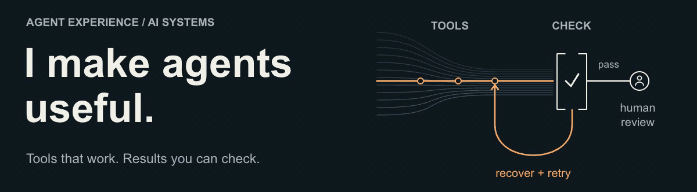

# Himadri Mishra

**Agent Experience (AX) · Agentic Systems · AI Product Engineering**

I build AI applications and tools that agents can use. My focus is helping them find the right tool, finish a task, and recover when something fails.

[Explore Agent Experience](https://agentexperience.tech/) · [Public repositories](https://github.com/hmishra2250?tab=repositories) · [Connect on LinkedIn](https://www.linkedin.com/in/hmishra2250/)

<picture>
  <source media="(max-width: 600px)" srcset="./assets/whole-task-mobile.svg">
  <source media="(prefers-reduced-motion: reduce)" srcset="./assets/whole-task.svg">
  
</picture>

## Start here

| Work | What you can explore |
| --- | --- |
| [Agent Experience](https://agentexperience.tech/) | My practical field guide to agent-facing products, with a working read-only MCP service. |
| [Agent-Readiness Rubric](https://agentexperience.tech/insights/agent-readiness-rubric/) | A published v0.1 draft for reviewing discovery, action safety, recovery, and human control. |
| [Awesome Agent Experience](https://github.com/hmishra2250/awesome-agent-experience) | Curated public resources on tool use, discovery, evaluation, and agent-facing interfaces. |
| [Qwen on a consumer GPU](https://github.com/hmishra2250/qwen-3.6-35b-consumer-gpu) | Local-inference scripts, an optimization guide, and recorded results for a specific hardware/model setup. |

## What I build

- **Agent-facing tools:** MCP, APIs, CLIs, reusable skills, onboarding, and actionable errors.
- **Evaluation loops:** realistic tasks, trace evidence, failure analysis, and fix-and-rerun workflows.
- **Agentic systems:** stateful orchestration, sandboxed execution, observability, and artifact verification.

My earlier work in ML infrastructure, search, and computer vision grounds these systems in reliability, latency, cost, and product constraints.

**How I work:** check the completed task, not just whether the answer sounds right. Make access, failures, and the points that need a person clear.

Use the field guide from an agent

The public, read-only MCP endpoint is `https://agentexperience.tech/api/mcp`.

It exposes `search_guides`, `get_guide`, `get_readiness_rubric`, and `get_glossary_term`. See the [discovery manifest](https://agentexperience.tech/.well-known/ard.json) for the published interface.

Some professional work is not public. I share reusable engineering patterns without disclosing client identities, private code, or internal results.
